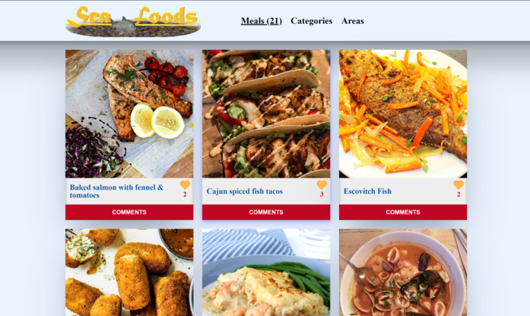

# Sea Foods

## Table of Contents

- [Sea Foods](#sea-foods)
  - [Table of Contents](#table-of-contents)
  - [About Project](#about-project)
  - [Live Demo](#live-demo)
  - [Video Demo Link](#video-demo-link)
  - [Built With](#built-with)
  - [Getting Started](#getting-started)
  - [API Interactions](#api-interactions)
    - [The MealDB](#the-mealdb)
    - [Involvement API](#involvement-api)
  - [Contributing](#contributing)
  - [Author](#author)
  - [Acknowledgements](#acknowledgements)
  - [Show your support](#show-your-support)

## About Project

Sea Foods is a project that enlists dishes of sea life regarded as food. Users get to interact to items in the list by liking and commenting on them after viewing some more information on a particular dish on a popup modal.

This project uses [TheMealDB](https://www.themealdb.com/api.php) API for populating the list of sea foods and the [Involvement](https://www.notion.so/Involvement-API-869e60b5ad104603aa6db59e08150270) API for adding likes and comments to any sea food item.



## [Live Demo](https://lameck1.github.io/Sea-Foods/)

## [Video Demo Link](https://youtu.be/TkcdUBXIKY4)

## Built With

* HTML5
* CSS
* Javascript
* Webpack
* [TheMealDB](https://www.themealdb.com/api.php) API
* [Involvement](https://www.notion.so/Involvement-API-869e60b5ad104603aa6db59e08150270) API

## Getting Started

* Clone this repo <https://github.com/Lameck1/Sea-Foods>

    ```bash
    git clone https://github.com/Lameck1/Sea-Foods.git
    ```

* Navigate to Sea-Foods folder/directory

    ```bash
    cd Sea-Foods
    ```

* On the comandline, at the project's root, run ```npm i``` to install app dependencies

* Next, run ```npm start``` which will build the project from ```src``` directory and serve into memory

* Go to ```http://localhost:9000/``` to interact with the app

* ALTERNATIVELY

  * Just run ```npm run build``` or ```npx webpack``` which will build the project and generate output files into the ```dist``` directory.

  * Go to ```dist``` directory and manually open ```index.html``` to interact with the app

## API Interactions

### The MealDB

From the MealDB API, this app/project is interacting/consuming this endpoint to get a list of meals:

```https://www.themealdb.com/api/json/v1/1/filter.php?c=Seafood```

### Involvement API

In this API, the app consumes the `/likes/` and the `/comments/` endpoints. Take a look at the [DOCUMENTATION](https://www.notion.so/Involvement-API-869e60b5ad104603aa6db59e08150270) and undestand how you can work with it.

## Contributing

Contributions, issues, and feature requests are welcome!

Feel free to check the [issues page](https://github.com/Lameck1/Sea-Foods/issues)

  1. Fork the Project
  2. Create your Feature Branch (`git checkout -b feature/newFeature`)
  3. Commit your Changes (`git commit -m 'Add some newFeature'`)
  4. Push to the Branch (`git push -u origin feature/newFeature`)
  5. Open a Pull Request

## Author

👤 **Lameck Otieno**

* GitHub: [@githubhandle](https://github.com/Lameck1)
* Twitter: [@twitterhandle](https://twitter.com/lameck721)
* LinkedIn: [LinkedIn](https://www.linkedin.com/in/lameck-odhiambo-642b7077/)
* Portfolio: [Portfolio](https://lameck.me)

👤 **Omoogun Olawale**

* Github: [@githubhandle](https://github.com/olawale-o)
* Twitter: [@twitterhandle](https://twitter.com/ibreaktherules)
* LinkedIn: [LinkedIn](https://www.linkedin.com/in/olawaleomoogun/)

## Acknowledgements

* [TheMealDB](https://www.themealdb.com/api.php) API
* [Involvement](https://www.notion.so/Involvement-API-869e60b5ad104603aa6db59e08150270) API

Credits also go to the following for providing guides on JavaScript

* [**MDN Web Docs**](https://developer.mozilla.org/en-US/docs/Learn/JavaScript/Objects)
* [Freecodecamp](https://www.freecodecamp.org/learn/javascript-algorithms-and-data-structures/)

## Show your support

Give a ⭐️ if you like this project!
